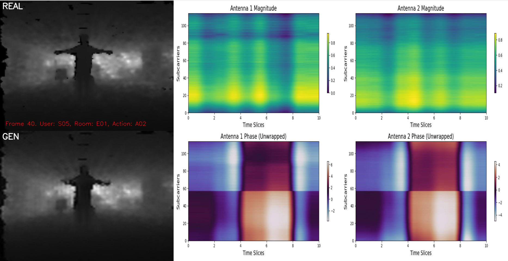
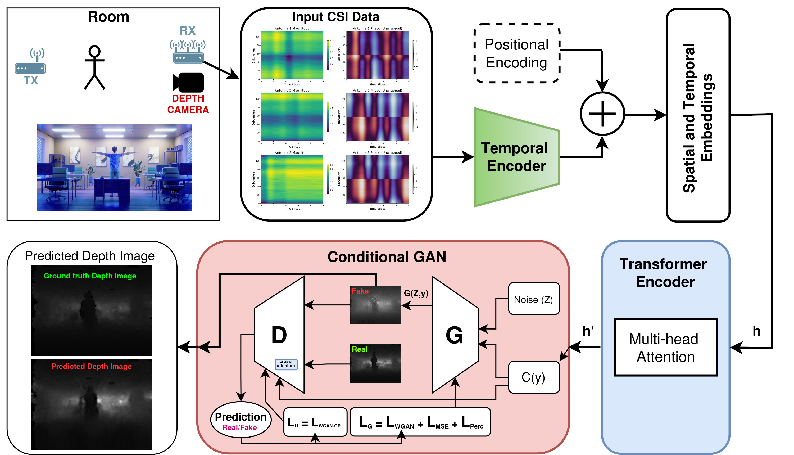

# CSI2Depth: Spatio-Temporal Depth Images from Wi-Fi CSI Data via Transformer Networks and conditional Generative Adversarial Networks
[](https://opensource.org/licenses/MIT)
[](https://www.python.org/downloads/release/python-380/)

This repository contains the official implementation of the paper "CSI2Depth: Spatio-Temporal Depth Images from Wi-Fi CSI Data via Transformer Networks and conditional Generative Adversarial Networks", presented at the Scandinavian Conference on Image Analysis (SCIA 2025).


[**[Paper]**](https://link.springer.com/chapter/10.1007/978-3-031-95911-0_26) - Accepted in the 23nd Scandinavian Conference on Image Analysis (SCIA 2025).

[**[Models]**](https://drive.google.com/drive/folders/10tyv_Qt4Ablo_TXdNCIDfkxPTOOdG2kb?usp=sharing) - Available checkpoints files for testing.

[**[Video]**](https://www.youtube.com/watch?v=tNGM4l1PZQQ) - Video demonstrating the inference of the model.

Authors: Constantino Álvarez Casado, Manuel Lage Cañellas, Janne Mustaniemi, Matteo Pedone, Olli Silvén, Miguel Bordallo López




## Project Description

This project explores the feasibility of estimating structured depth maps from passive Wi-Fi Channel State Information (CSI) using data-driven deep learning techniques. The proposed model combines a transformer encoder to extract spatio-temporal features from raw 5 GHz SIMO CSI (amplitude and phase), and a conditional Generative Adversarial Network (cGAN) to synthesize dense depth maps. Unlike prior work focused on activity recognition or point cloud prediction [1], this approach outputs dense, pixel-wise depth images compatible with traditional computer vision pipelines. It enables spatial scene understanding without requiring additional active sensors, opening possibilities for passive, infrastructure-based environmental sensing. The model is evaluated on the MM-Fi dataset [2], demonstrating its ability to infer human presence and geometric obstructions based solely on wireless signal variations.


## Abstract
Depth estimation is critical for 3D reconstruction, robotics, and extended reality. It is also increasingly relevant in Integrated Sensing and Communication (ISAC), where environmental awareness improves beamforming, network adaptation, and digital twin construction. Traditional depth and RF-based sensors provide accurate measurements but often require active transmissions or dedicated devices. In contrast, Wi-Fi CSI offers a passive sensing alternative using existing infrastructure. However, RF-based depth estimation remains challenging due to multipath propagation, occlusions, and diffraction. This work introduces a data-driven architecture that estimates depth maps from raw SIMO CSI using a transformer encoder and a conditional generative adversarial network. The model processes spatio-temporal CSI features and generates dense, structured depth images. Evaluation on the MM-Fi dataset confirms the feasibility of passive depth estimation under stable signal conditions. This contributes to emerging ISAC frameworks in wireless sensing.




### Architecture Overview

The **CSI2Depth** pipeline transforms raw Wi-Fi Channel State Information (CSI) into depth images through three main stages:

1. CSI Preprocessing
Raw Single-Input Multiple-Output (SIMO) Wi-Fi CSI data, including amplitude and phase over multiple time windows, is reshaped and prepared as input for the network.

2. Transformer-Based CSI Encoder
This module extracts spatio-temporal feature embeddings from the preprocessed CSI. It is designed to capture the complex interactions across antennas, subcarriers, and time slices, creating a structured latent representation of the environment.

3. Conditional Generative Adversarial Network (cGAN)
This network synthesizes pixel-level depth maps conditioned on the feature embeddings from the Transformer Encoder. It consists of two main components:
   * **Generator Network:** A deconvolutional network that progressively upsamples the compressed CSI feature embeddings into the final, high-resolution depth image.

   * **Discriminator Network:** This network evaluates the realism of the generated depth images. It learns to distinguish between real depth maps and those created by the generator, conditioned on their corresponding CSI features. This adversarial process guides the generator to produce outputs that are both realistic and consistent with the input CSI data.


## Installation
If you want to use our test and evaluation application, clone the repository and follow the instructions.

```
git clone https://github.com/Arritmic/csi2depth.git
cd csi2depth
```

### Requirements
* Python 3.8+
* Linux and Windows
* PyTorch ≥ 2.2.2
* See also requirements.txt and environment.yml files

Some Linux distributions may not include all of the tools required by the dependencies. If you see errors during the `pip3` installation, you might need to manually install additional packages as indicated in your distribution's package manager.

### Script for Installation
For the installation of the _requirements_ and _environment_, run the script:
* Run: `./install.sh`

If you are using Windows, use the _environment.yml_ file to install the dependencies.

> **Note:** The code is **not tested regularly on Windows**. It has been fully tested on Linux Ubuntu OS.

### Dataset
The model is trained and evaluated on the MM-Fi Dataset [2], a public dataset containing synchronized CSI, LiDAR, and RGB-D data across several indoor scenes. You can request access or follow the dataset guidelines as indicated in the original paper.

> **Note:**  We do not redistribute the raw MM-Fi dataset. Please refer to the official MM-Fi paper for instructions on accessing the data.


### Inference Demo

You can reproduce the results from the paper using the provided pre-trained model:

```
python visual_inference_test.py
```
This script loads the pre-trained model, processes example CSI data, and generates output depth maps.


## TODO List
 - [X] Code for transformer + cGAN architecture
 - [X] Inference and visualization tools
 - [ ] Model training script
 - [ ] Evaluation of the model on additional datasets
 - [ ] Evaluation metrics and quantitative benchmarking
 - [ ] Improved data augmentation strategies to enhance model generalizability
 - [ ] Refined visualization tools for depth video output


##  Citation
```
@inproceedings{alvarez2025csi2depth,
  title={CSI2Depth: Spatio-Temporal Depth Images from Wi-Fi CSI Data via Transformer Networks and conditional Generative Adversarial Networks},
  author={Álvarez Casado, Constantino and Lage Cañellas, Manuel and Mustaniemi, Janne and Pedone, Matteo and Silvén, Olli and Bordallo López, Miguel},
  booktitle={Scandinavian Conference on Image Analysis (SCIA)},
  year={2025}
}
```

## Authors and Acknowledgment
This project is developed by the Multimodal Sensing Lab (MMSLab) team of the Center for Machine Vision and Signal Analysis (CMVS) 
at the University of Oulu.
* **Authors**: Constantino Álvarez Casado, Manuel Lage Cañellas, Janne Mustaniemi, Matteo Pedone, Olli Silvén, Miguel Bordallo López
* **Contact Information**: 
  * For general questions, contact the team leader: miguel.bordallo [at] oulu.fi
  * For code-related issues and technical questions, contact: constantino.alvarezcasado [at] oulu.fi

We acknowledge the contributions of everyone involved in this project and appreciate any further contributions or feedback from the community.

## License
This project is licensed under the MIT License - see the LICENSE.md file for details.

## References

[1] T. Määttä, S. Sharifipour, M. Bordallo López and C. Álvarez Casado, "Spatio-Temporal 3D Point Clouds from Wi-Fi-CSI Data via Transformer Networks," 2025 IEEE 5th International Symposium on Joint Communications & Sensing (JC&S), Oulu, Finland, 2025, pp. 1-6, doi: 10.1109/JCS64661.2025.10880635.

[2] Yang, Jianfei, He Huang, Yunjiao Zhou, Xinyan Chen, Yuecong Xu, Shenghai Yuan, Han Zou, Chris Xiaoxuan Lu, and Lihua Xie. "Mm-fi: Multi-modal non-intrusive 4d human dataset for versatile wireless sensing." Advances in Neural Information Processing Systems 36 (2024).
